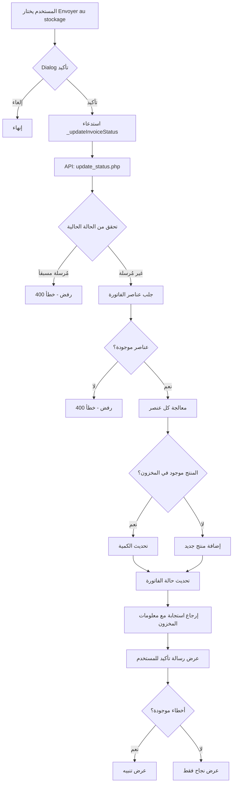

# ملخص تكامل نظام المخزون مع فواتير الشراء

## نظرة عامة
تم إنشاء نظام متكامل لإرسال بيانات فواتير الشراء تلقائياً إلى جدول المخزون في قاعدة البيانات عند اختيار الحالة "Envoyer au stockage".

---

## الملفات المُنشأة

### 1. Backend (PHP APIs)

#### [lib/api_amrts_manager/api/inventory/inventory_create_from_invoice.php](lib/api_amrts_manager/api/inventory/inventory_create_from_invoice.php)
- **الوظيفة:** إنشاء/تحديث عناصر المخزون من فاتورة
- **Method:** POST
- **المميزات:**
  - يتحقق من وجود المنتج قبل الإضافة
  - يحدث الكمية إذا كان المنتج موجوداً
  - يضيف منتج جديد إذا لم يكن موجوداً
  - يسجل رقم الفاتورة في الملاحظات

#### [lib/api_amrts_manager/api/inventory/inventory_read_all.php](lib/api_amrts_manager/api/inventory/inventory_read_all.php)
- **الوظيفة:** جلب جميع عناصر المخزون
- **Method:** GET
- **الترتيب:** حسب آخر تحديث (DESC)

---

## الملفات المُعدّلة

### 1. Backend (PHP)

#### [lib/api_amrts_manager/api/invoices/update_status.php](lib/api_amrts_manager/api/invoices/update_status.php)
**التعديلات:**
- إضافة تحقق من الحالة الحالية للفاتورة
- منع تغيير الحالة إذا كانت الفاتورة قد أرسلت للمخزون
- إضافة آلية إرسال تلقائية للمخزون عند اختيار "Envoyer au stockage"
- إضافة معلومات مفصلة في الاستجابة عن عدد المنتجات المعالجة

**الكود المضاف:**
```php
// التحقق من الحالة الحالية
if ($currentInvoice['status'] === 'Envoyer au stockage' && $input['status'] !== 'Envoyer au stockage') {
    // منع التغيير
}

// إرسال للمخزون تلقائياً
if ($input['status'] === 'Envoyer au stockage' && $currentInvoice['status'] !== 'Envoyer au stockage') {
    // إضافة/تحديث عناصر المخزون
}

// إضافة معلومات المخزون في الاستجابة
$response['inventory'] = [
    'items_processed' => $insertedCount,
    'total_items' => count($items),
    'errors' => $errors
];
```

---

### 2. Flutter (Dart)

#### [lib/model/api_services.dart](lib/model/api_services.dart)
**التعديلات:**
- إضافة دالة `getAllInventory()` - جلب جميع عناصر المخزون
- إضافة دالة `sendInvoiceToInventory(String invoiceId)` - إرسال فاتورة للمخزون

**الكود المضاف:**
```dart
// خدمات المخزون (Inventory)
static Future<List<Map<String, dynamic>>> getAllInventory() async {
  // جلب جميع عناصر المخزون من API
}

static Future<Map<String, dynamic>> sendInvoiceToInventory(String invoiceId) async {
  // إرسال فاتورة محددة إلى المخزون
}
```

---

#### [lib/screens/purchases_screen.dart](lib/screens/purchases_screen.dart)
**التعديلات:**
- تحديث دالة `_updateInvoiceStatus` لعرض معلومات مفصلة
- إضافة رسالة تأكيد تتضمن:
  - عدد المنتجات المضافة للمخزون
  - إجمالي عدد المنتجات
  - تنبيهات في حالة وجود أخطاء

**الكود المضاف:**
```dart
// إضافة معلومات المخزون إذا كانت متوفرة
if (newStatus == 'Envoyer au stockage' && updatedInvoice['inventory'] != null) {
  final inventory = updatedInvoice['inventory'];
  final itemsProcessed = inventory['items_processed'] ?? 0;
  final totalItems = inventory['total_items'] ?? 0;

  if (itemsProcessed > 0) {
    message += '\n✓ تم إضافة $itemsProcessed من أصل $totalItems منتج إلى المخزون';
  }

  if (inventory['errors'] != null && (inventory['errors'] as List).isNotEmpty) {
    message += '\n⚠ بعض المنتجات لم يتم إضافتها بشكل صحيح';
  }
}
```

---

## تخطيط البيانات (Data Mapping)

### من invoice_items إلى inventory:

| invoice_items | inventory | الوصف |
|--------------|-----------|-------|
| `ref_article` | `ref_article` | رمز المنتج |
| `articles` | `articleName` | اسم المنتج |
| `refFournisseur` | `supplierRef` | مرجع المورد |
| `qte` | `quantity` | الكمية |
| `puPieces` | `unitPrice` | سعر الوحدة |
| `qte * puPieces` | `totalValue` | القيمة الإجمالية |
| - | `category` | الفئة (NULL افتراضياً) |
| - | `unit` | الوحدة (NULL افتراضياً) |
| - | `location` | الموقع (NULL افتراضياً) |
| - | `minStock_KG` | الحد الأدنى (NULL افتراضياً) |
| - | `maxStock_KG` | الحد الأقصى (NULL افتراضياً) |
| - | `lastUpdated` | وقت التحديث (GETDATE) |
| - | `status` | الحالة ("En stock") |

### من invoices إلى inventory:

| invoices | inventory | الوصف |
|----------|-----------|-------|
| `clientName` | `supplierName` | اسم المورد |
| `invoiceNumber` | `invoiceNumber` | رقم الفاتورة |

---

## سير العمل (Workflow)



---

## الأمان والحماية

### 1. منع التكرار
- يتم التحقق من `(ref_article, supplierRef, invoiceNumber)` قبل الإضافة
- في حالة التكرار، يتم تحديث الكمية فقط

### 2. منع التعديل بعد الإرسال
- بمجرد إرسال الفاتورة للمخزون، لا يمكن تغيير حالتها
- أزرار التعديل والحذف تصبح معطلة في UI

### 3. معالجة الأخطاء
- كل عنصر يُعالج بشكل مستقل
- في حالة فشل عنصر، تستمر معالجة العناصر الأخرى
- يتم تسجيل جميع الأخطاء وإبلاغ المستخدم

---

## الاختبار

### 1. اختبار إضافة فاتورة جديدة للمخزون:
```bash
# إنشاء فاتورة جديدة
# اختيار "Envoyer au stockage"
# التحقق من إضافة المنتجات في جدول inventory
```

### 2. اختبار تحديث كمية منتج موجود:
```bash
# إنشاء فاتورة بمنتج موجود مسبقاً
# اختيار "Envoyer au stockage"
# التحقق من تحديث quantity و totalValue
```

### 3. اختبار منع التعديل بعد الإرسال:
```bash
# إرسال فاتورة للمخزون
# محاولة تغيير الحالة
# يجب أن يتم رفض الطلب
```

### 4. اختبار flutter analyze:
```bash
flutter analyze lib/screens/purchases_screen.dart lib/model/api_services.dart lib/widgets/invoice_card.dart
```
✅ **النتيجة:** No issues found!

---

## ملاحظات مهمة

### 1. قاعدة البيانات
- تأكد من وجود جدول `inventory` في قاعدة البيانات
- الحقول المطلوبة: `ref_article`, `articleName`, `supplierRef`, `quantity`, `unitPrice`, `totalValue`, `supplierName`, `invoiceNumber`, `lastUpdated`, `status`, `notes`

### 2. الأداء
- العملية تتم بشكل تزامني (synchronous)
- في حالة وجود عدد كبير من العناصر، قد تستغرق العملية وقتاً
- يمكن تحسين الأداء بإستخدام batch insert

### 3. التوسعات المستقبلية
- إضافة صفحة لعرض المخزون في التطبيق
- إضافة إشعارات عند انخفاض المخزون
- إضافة تقارير المخزون
- إمكانية إلغاء الإرسال للمخزون (undo)

---

## الملفات التوثيقية

- [lib/api_amrts_manager/api/inventory/README.md](lib/api_amrts_manager/api/inventory/README.md) - توثيق كامل لـ APIs المخزون

---

## الدعم

في حالة وجود مشاكل أو استفسارات، يرجى التحقق من:
1. ملفات logs في `lib/api_amrts_manager/logs/`
2. استخدام Postman لاختبار APIs
3. فحص console في Flutter للأخطاء

---

**تاريخ الإنشاء:** 2025-11-05
**الإصدار:** 1.0.0
**الحالة:** ✅ مكتمل وجاهز للإستخدام
